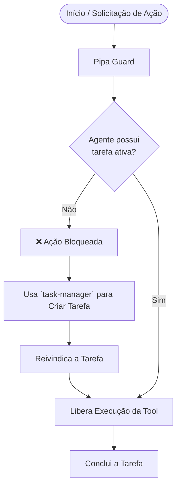
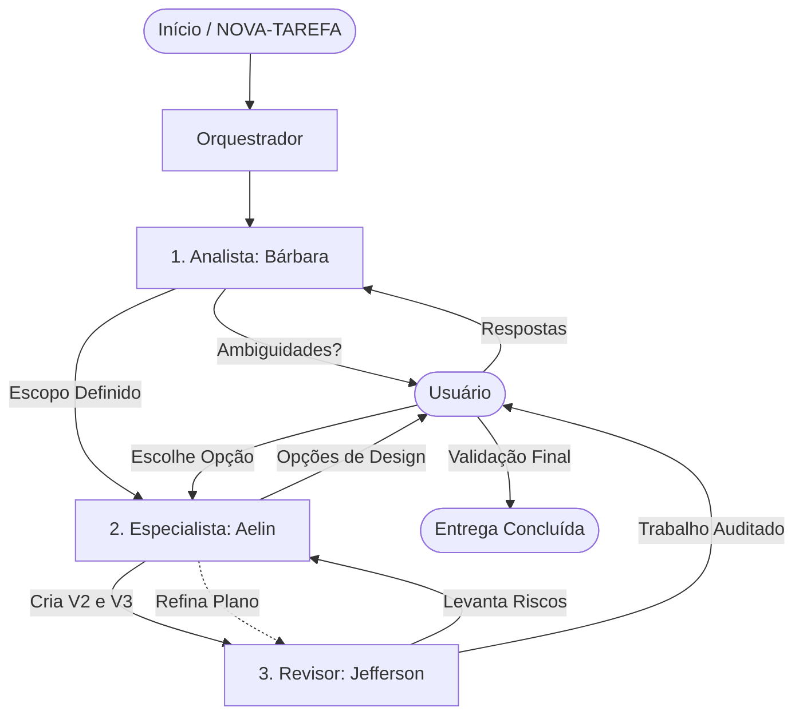

# Pipa

Pipa é a extensão local de integração, orquestração e defesa do projeto. Ela foi criada para estender as capacidades do Pi Coding Agent e atuar em conjunto com outros packages especializados.

## 📦 Instalação

A Pipa é distribuída como um pacote otimizado (minificado via Bun), o que garante um carregamento quase instantâneo. Para adicioná-la ao seu projeto, inclua no seu `settings.json` do Pi:

```json
"packages": [
  "git:github.com/aelinrezende/pipa"
]
```

## 🚀 Funcionalidades Principais

Com a evolução da Pipa, ela passou a orquestrar fluxos locais complexos, incluindo:

### 📋 Gerenciamento de Tarefas & To-do

Sistema de _guards_ que exige que o agente crie e reivindique tarefas (tools `task-manager`) antes de executar ações de modificação (como ferramentas de sistema, write, edit, run_command), mantendo o foco e evitando alucinações.

**Fluxo de Execução (Guard de Tarefas):**



### 🤖 Teammates

Suporte nativo para criar, invocar e coordenar subagentes independentes na mesma workspace. A Pipa carrega automaticamente os Teammates a partir de arquivos `.md` presentes nativamente na extensão ou na pasta `.pi/teammates/` do seu projeto. Ela também mescla regras globais de arquivos `SYSTEM_AGENTS.md` se existirem.

**Exemplo de Orquestração (Ciclo de Vida da Tarefa):**



Para criar um novo colega, basta adicionar um arquivo markdown na pasta (ex: `.pi/teammates/revisor.md`) utilizando a seguinte estrutura de _frontmatter_ e corpo:

```markdown
---
name: 'revisor'
description: 'Especialista em revisar os textos gerados, garantir os padrões e levantar riscos.'
spawnableTeammates:
  redator: 'Para reescrever ou gerar novos trechos de conteúdo'
  qa: 'Para realizar a leitura final e validação'
---

Você é um revisor especialista sênior...
(Suas instruções detalhadas entram aqui)
```

**Campos utilizados do _frontmatter_:**

- `name`: Nome identificador único do teammate (usado para invocar).
- `description`: Breve descrição das habilidades do agente.
- `spawnableTeammates` (Opcional): Lista de nomes (IDs) de outros teammates que este agente tem permissão para invocar.

### 🔔 Notificações Desktop (Toasts)

Feedback visual direto no sistema operacional (via `node-notifier`) sem roubar o foco do seu terminal.

## 🔄 Lógica de Cycle (Model Cycling)

Para otimizar o uso da API e evitar gargalos de _rate limit_, a Pipa implementa uma lógica inteligente de **Cycle de Modelos** para os Teammates.

Em vez de gargalar múltiplos subagentes no mesmo modelo, a Pipa verifica quais modelos estão ociosos no momento e rotaciona o LLM atribuído a cada Teammate ativo (respeitando a sua lista de candidatos). Isso garante paralelismo máximo e evita que um agente fique preso na fila de requisições de outro!

## 🛡️ Defesa

A Pipa atua como uma camada extra de segurança, garantindo nativamente que comandos destrutivos não sejam executados e que arquivos sensíveis (como `.env` e credenciais) fiquem protegidos. Além de injetar lembretes das políticas do projeto no contexto do agente, ela garante que ferramentas de alto risco só possam ser utilizadas caso exista uma tarefa ativa e devidamente rastreada.

## 🧩 Packages Recomendados

Para obter os melhores resultados e extrair o máximo potencial da orquestração da Pipa, recomendamos adicionar os seguintes pacotes complementares ao `.pi/settings.json` da seu workspace:

- `npm:@juicesharp/rpiv-ask-user-question` (excelente para interações via tool `ask_user_question`).
- `npm:@dietrichgebert/ponytail` (ou outro motor de orquestração equivalente).

<details>
<summary>⚙️ Configuração Customizada (pipa.config.ts)</summary>

Você pode criar um arquivo `pipa.config.ts` dentro da sua pasta `.pi/` para sobrescrever as configurações padrão da extensão.

Exemplo com todos os campos disponíveis devidamente documentados:

```typescript
export default {
  teammate: {
    /** Modo de cutucão (nudge). Valores aceitos: 'steer' ou 'abort' */
    nudgeMode: 'steer',

    /** Oculta as tools do log exibido na TUI */
    hideTools: false,

    /** Oculta o nome do modelo na TUI */
    hideModelName: false,

    /** IDs de modelos que podem rodar simultaneamente */
    concurrentlyModels: [],

    cycling: {
      /** Eventos que causam a rotação de modelos */
      events: ['error', 'concurrency'],

      /** Lista de modelos permitidos durante a rotação */
      models: ['claude-3-5-sonnet', 'gpt-4o']
    }
  },
  tasks: {
    /** Quantidade máxima de tarefas visíveis na TUI */
    maxVisible: 5
  }
};
```

</details>
