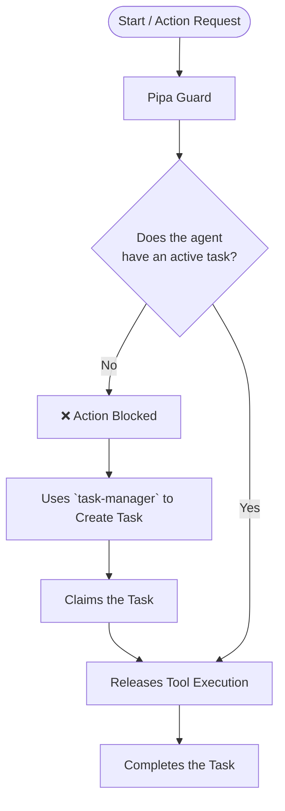
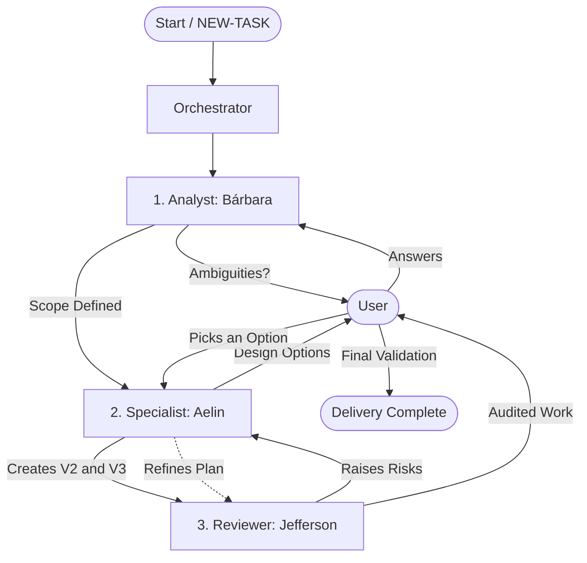

# Pipa

Pipa is the local extension for integration, orchestration, and defense of the project. It was created to extend the capabilities of the Pi Coding Agent and to work alongside other specialized packages.

## 📦 Installation

Pipa is distributed as an optimized package (minified via Bun), which ensures near-instant loading. To add it to your project, include the following in your Pi `settings.json`:

```json
"packages": [
  "git:github.com/aelinrezende/pipa"
]
```

## 🚀 Main Features

As Pipa evolved, it started orchestrating complex local flows, including:

### 📋 Task & To-do Management

A system of _guards_ that requires the agent to create and claim tasks (the `task-manager` tools) before performing any modification actions (such as system tools, write, edit, run_command), keeping focus and preventing hallucinations.

**Execution Flow (Task Guard):**


```mermaid
graph TD
    Start([Start / Action Request]) --> Guard[Pipa Guard]
    Guard --> CheckTask{Does the agent<br>have an active task?}
    CheckTask -->|No| Blocked[❌ Action Blocked]
    Blocked --> CreateTask[Uses `task-manager` to Create Task]
    CreateTask --> ClaimTask[Claims the Task]
    ClaimTask --> Execute[Releases Tool Execution]
    CheckTask -->|Yes| Execute
    Execute --> CompleteTask[Completes the Task]
```

### 🤖 Teammates

Native support for creating, invoking, and coordinating independent subagents in the same workspace. Pipa automatically loads Teammates from `.md` files shipped with the extension or found in the project's `.pi/teammates/` folder. It also merges global rules from `SYSTEM_AGENTS.md` files if they exist.

**Orchestration Example (Task Lifecycle):**


```mermaid
graph TD
    Start([Start / NEW-TASK]) --> Orchestrator[Orchestrator]
    Orchestrator --> PM[1. Analyst: Bárbara]
    PM -->|Ambiguities?| User([User])
    User -->|Answers| PM
    PM -->|Scope Defined| Creator[2. Specialist: Aelin]
    Creator -->|Design Options| User
    User -->|Picks an Option| Creator
    Creator -->|Creates V2 and V3| Reviewer[3. Reviewer: Jefferson]
    Reviewer -->|Raises Risks| Creator
    Creator -.->|Refines Plan| Reviewer
    Reviewer -->|Audited Work| User
    User -->|Final Validation| End([Delivery Complete])
```

To create a new teammate, just add a markdown file to the folder (e.g. `.pi/teammates/reviewer.md`) using the following _frontmatter_ and body structure:

```markdown
---
name: 'reviewer'
description: 'Specialist in reviewing generated texts, enforcing standards, and raising risks.'
spawnableTeammates:
  writer: 'To rewrite or generate new content passages'
  qa: 'To perform the final read and validation'
---

You are a senior specialist reviewer...
(Your detailed instructions go here)
```

**Frontmatter fields used:**

- `name`: Unique identifier name of the teammate (used to invoke it).
- `description`: Brief description of the agent's skills.
- `spawnableTeammates` (Optional): List of names (IDs) of other teammates this agent is allowed to invoke.

### 🔔 Desktop Notifications (Toasts)

Direct visual feedback in the operating system (via `node-notifier`) without stealing focus from your terminal.

## 🔄 Cycle Logic (Model Cycling)

To optimize API usage and avoid _rate limit_ bottlenecks, Pipa implements smart **Model Cycling** logic for Teammates.

Instead of bottlenecking multiple subagents on the same model, Pipa checks which models are currently idle and rotates the LLM assigned to each active Teammate (respecting its candidate list). This ensures maximum parallelism and keeps an agent from getting stuck in another agent's request queue.

## 🛡️ Defense

Pipa acts as an extra security layer, natively ensuring that destructive commands are not executed and that sensitive files (such as `.env` and credentials) stay protected. Besides injecting project policy reminders into the agent context, it ensures high-risk tools can only be used when there is an active, properly tracked task.

## 🧩 Recommended Packages

To get the best results and extract the most from Pipa's orchestration, we recommend adding the following complementary packages to your workspace `.pi/settings.json`:

- `npm:@juicesharp/rpiv-ask-user-question` (great for interactions via the `ask_user_question` tool).
- `npm:@dietrichgebert/ponytail` (or another equivalent orchestration engine).

<details>
<summary>⚙️ Custom Configuration (pipa.config.ts)</summary>

You can create a `pipa.config.ts` file inside your `.pi/` folder to override the extension's default settings.

Example with every available field properly documented:

```typescript
export default {
  teammate: {
    /** Nudge mode. Accepted values: 'steer' or 'abort' */
    nudgeMode: 'steer',

    /** Hides tools from the log shown in the TUI */
    hideTools: false,

    /** Hides the model name in the TUI */
    hideModelName: false,

    /** Model IDs that can run simultaneously */
    concurrentlyModels: [],

    cycling: {
      /** Events that trigger model rotation */
      events: ['error', 'concurrency'],

      /** List of models allowed during rotation */
      models: ['claude-3-5-sonnet', 'gpt-4o']
    }
  },
  tasks: {
    /** Maximum number of tasks visible in the TUI */
    maxVisible: 5
  }
};
```

</details>
